# Testing Mermaid Diagrams

## How to Use These Diagrams

1. Make sure you have VS Code installed with these extensions:
   - Markdown Preview Enhanced
   - Markdown Preview Mermaid Support

2. To view the diagrams:
   - Press `Ctrl+Shift+V` to open preview
   - Or `Ctrl+K V` to open preview to the side

3. To edit diagrams:
   - Edit the code between the ```mermaid tags
   - The preview will update automatically

## 1. System Architecture Diagram

This diagram shows the overall system structure:

```mermaid
graph TD
    %% Style definitions
    classDef userInterface fill:#2196f3,stroke:#1976d2,stroke-width:2px,color:#fff,font-weight:bold
    classDef authentication fill:#673ab7,stroke:#512da8,stroke-width:2px,color:#fff,font-weight:bold
    classDef coreSystem fill:#00bcd4,stroke:#0097a7,stroke-width:2px,color:#fff,font-weight:bold
    classDef security fill:#f44336,stroke:#d32f2f,stroke-width:2px,color:#fff,font-weight:bold
    classDef network fill:#4caf50,stroke:#388e3c,stroke-width:2px,color:#fff,font-weight:bold
    classDef monitoring fill:#ff9800,stroke:#f57c00,stroke-width:2px,color:#fff,font-weight:bold

    subgraph "Frontend Layer"
        GUI["🖥️ GUI Dashboard<br/>Web Interface<br/>Real-time Updates"]
        CLI["⌨️ CLI Tools<br/>Command Line<br/>Automation"]
        API["🔌 API Gateway<br/>REST/WebSocket<br/>Integration"]
    end

    subgraph "Authentication"
        AUTH["🔐 Auth Service<br/>Multi-factor<br/>SSO"]
        RBAC["👥 Role Manager<br/>Access Control<br/>Permissions"]
    end

    subgraph "Core Services"
        CORE["⚙️ Core Engine<br/>Orchestration<br/>Processing"]
        RULES["📋 Rule Manager<br/>Policy Engine<br/>Templates"]
        CONFIG["⚡ Config System<br/>Settings<br/>Profiles"]
    end

    subgraph "Security Layer"
        IDS["🛡️ IDS/IPS<br/>Threat Detection<br/>Response"]
        FW["🔥 Firewall Core<br/>Packet Filter<br/>NAT"]
        DOS["🚫 DoS Protection<br/>Rate Limiting<br/>Defense"]
    end

    subgraph "Network Layer"
        NET["🌐 Network Stack<br/>Interface Control<br/>Routing"]
        PKT["📦 Packet Process<br/>Deep Inspection<br/>Analysis"]
    end

    subgraph "Monitoring"
        LOG["📊 Logger<br/>Event Tracking<br/>Analytics"]
        ALERT["⚠️ Alert System<br/>Notifications<br/>Reports"]
    end

    GUI & CLI & API --> |"secure channel"| AUTH
    AUTH --> |"validate"| RBAC
    RBAC --> |"authorize"| CORE
    CORE --> |"manage"| RULES & CONFIG
    RULES & CONFIG --> |"configure"| FW
    FW --> |"protect"| NET
    NET --> |"analyze"| PKT
    PKT --> |"detect"| IDS
    IDS & FW & DOS --> |"report"| LOG
    LOG --> |"trigger"| ALERT

    class GUI,CLI,API userInterface
    class AUTH,RBAC authentication
    class CORE,RULES,CONFIG coreSystem
    class IDS,FW,DOS security
    class NET,PKT network
    class LOG,ALERT monitoring
```



## 2. Security Workflow Diagram

This diagram shows the packet processing flow:

```mermaid
graph LR
    %% Style definitions
    classDef input fill:#3949ab,stroke:#283593,stroke-width:2px,color:#fff,font-weight:bold
    classDef process fill:#00acc1,stroke:#0097a7,stroke-width:2px,color:#fff,font-weight:bold
    classDef decision fill:#e64a19,stroke:#d84315,stroke-width:2px,color:#fff,font-weight:bold
    classDef action fill:#43a047,stroke:#388e3c,stroke-width:2px,color:#fff,font-weight:bold
    classDef monitor fill:#8e24aa,stroke:#7b1fa2,stroke-width:2px,color:#fff,font-weight:bold

    subgraph "Traffic Processing"
        IN["📥 Incoming<br/>Traffic"]
        SCAN["🔍 Initial<br/>Scan"]
        STATE["📊 State<br/>Check"]
    end

    subgraph "Security Analysis"
        THREAT["⚔️ Threat<br/>Detection"]
        RISK["⚖️ Risk<br/>Assessment"]
        POLICY["📜 Policy<br/>Validation"]
    end

    subgraph "Action Layer"
        DEC{"🎯 Decision<br/>Engine"}
        ACT["✅ Accept"]
        DROP["❌ Drop"]
        ALERT["⚠️ Alert"]
    end

    subgraph "Monitoring"
        LOG["📝 Logging"]
        REPORT["📊 Reports"]
        NOTIFY["📧 Notify"]
    end

    IN -->|"scan"| SCAN
    SCAN -->|"verify"| STATE
    STATE -->|"analyze"| THREAT
    THREAT -->|"evaluate"| RISK
    RISK -->|"check"| POLICY
    POLICY -->|"decide"| DEC
    DEC -->|"pass"| ACT
    DEC -->|"block"| DROP
    DEC -->|"warn"| ALERT
    ACT & DROP & ALERT --> LOG
    LOG --> REPORT
    REPORT -->|"important"| NOTIFY

    class IN,SCAN,STATE input
    class THREAT,RISK,POLICY process
    class DEC decision
    class ACT,DROP,ALERT action
    class LOG,REPORT,NOTIFY monitor
```



## 3. Template System Diagram

This diagram shows the template management system:

```mermaid
graph TD
    %% Style definitions
    classDef template fill:#5c6bc0,stroke:#3949ab,stroke-width:2px,color:#fff,font-weight:bold
    classDef config fill:#26a69a,stroke:#00897b,stroke-width:2px,color:#fff,font-weight:bold
    classDef security fill:#ef5350,stroke:#e53935,stroke-width:2px,color:#fff,font-weight:bold
    classDef feature fill:#7e57c2,stroke:#5e35b1,stroke-width:2px,color:#fff,font-weight:bold

    subgraph "🎨 Template Profiles"
        T1["🌐 Web Server<br/>HTTP/HTTPS<br/>SSL/TLS"]
        T2["💾 Database<br/>MySQL/PostgreSQL<br/>Secure Access"]
        T3["⚙️ Development<br/>Debug Ports<br/>Test Environment"]
        T4["🛡️ High Security<br/>Minimal Access<br/>Maximum Protection"]
    end

    subgraph "⚡ Features"
        F1["🔍 Deep Inspection<br/>Protocol Analysis<br/>Content Filtering"]
        F2["🚫 DoS Protection<br/>Rate Limiting<br/>Connection Control"]
        F3["🛡️ IPS Features<br/>Threat Detection<br/>Auto-Response"]
    end

    subgraph "🔒 Security Rules"
        S1["🎯 Access Control<br/>IP Filtering<br/>User Authentication"]
        S2["🕒 Time-Based<br/>Schedule Rules<br/>Access Windows"]
        S3["📍 Geo-Blocking<br/>Country Rules<br/>Region Filters"]
    end

    subgraph "📊 Monitoring"
        M1["📈 Performance<br/>Resource Usage<br/>Throughput"]
        M2["📝 Logging<br/>Event Recording<br/>Audit Trail"]
        M3["⚠️ Alerts<br/>Notifications<br/>Reports"]
    end

    T1 & T2 & T3 & T4 -->|"configure"| F1 & F2 & F3
    F1 & F2 & F3 -->|"enforce"| S1 & S2 & S3
    S1 & S2 & S3 -->|"monitor"| M1 & M2 & M3

    class T1,T2,T3,T4 template
    class F1,F2,F3 feature
    class S1,S2,S3 security
    class M1,M2,M3 config
```



## 4. Attack Response Diagram

This diagram shows the threat detection and response system:


## How to Modify These Diagrams

1. **Basic Syntax:**
   - Nodes: `NodeID["Label"]`
   - Connections: `NodeA --> NodeB`
   - Styled Connections: `NodeA -->|"label"| NodeB`
   - Groups: `subgraph "Title" ... end`

2. **Styling:**
   - Define styles: `classDef styleName fill:#color,...`
   - Apply styles: `class NodeID styleName`
   - Multiple nodes: `class Node1,Node2,Node3 styleName`

3. **Common Operations:**
   - Add node: `NewNode["🆕 Label"]`
   - Connect nodes: `NewNode --> ExistingNode`
   - Group nodes: 
     ```mermaid
     subgraph "Group Name"
         Node1
         Node2
     end
     ```

4. **Tips:**
   - Use emojis for visual appeal
   - Keep consistent color schemes
   - Use meaningful labels
   - Group related components
   - Add descriptive connection labels

## Keyboard Shortcuts

1. **VS Code Navigation:**
   - `Ctrl+Shift+V`: Open preview
   - `Ctrl+K V`: Split preview
   - `Ctrl+S`: Save and update
   - `Alt+Z`: Toggle word wrap

2. **Editing Tips:**
   - Use multi-cursor: `Alt+Click`
   - Select similar: `Ctrl+D`
   - Block select: `Alt+Shift+Click`
   - Find/Replace: `Ctrl+F` 