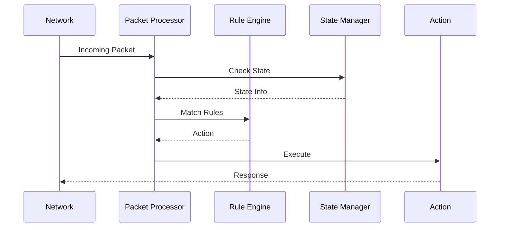
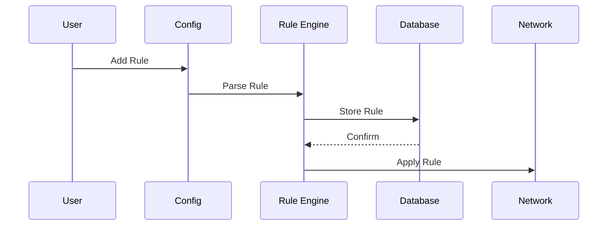
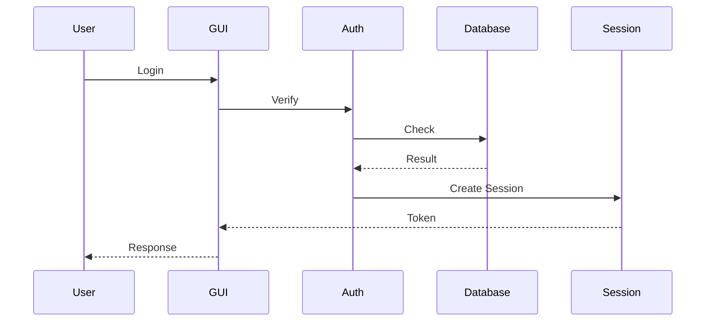

# BaselFirewall Architecture Guide

<div style="text-align: center; margin: 2em 0;">
<h2>B. Abu-Radaha</h2>
<p>Supervisor: M. Nabrawi</p>
<p>Hittien College</p>
<p>May 2025</p>
</div>

## Table of Contents

## System Architecture

### Core Components
```
BaselFirewall/
├── Core Engine
│   ├── Packet Processor
│   ├── Rule Engine
│   └── State Manager
├── Security Modules
│   ├── IDS/IPS
│   ├── DoS Protection
│   └── NAT
├── User Interface
│   ├── GUI
│   └── CLI
└── Management
    ├── User Manager
    ├── Config Manager
    └── Log Manager
```

## Component Details

### Core Engine

#### Packet Processor
- Netfilter integration
- Protocol handlers
- Queue management
- Performance optimization
- Packet classification

#### Rule Engine
- Rule parsing
- Rule matching
- Rule optimization
- Chain management
- Action execution

#### State Manager
- Connection tracking
- State table
- Timeout handling
- Session management
- Resource cleanup

### Security Modules

#### IDS/IPS
- Pattern matching
- Protocol analysis
- Signature database
- Alert generation
- Response actions

#### DoS Protection
- Rate limiting
- Connection tracking
- Resource monitoring
- Blacklist management
- Traffic analysis

#### NAT
- Address translation
- Port forwarding
- Connection tracking
- Rule management
- Performance optimization

### User Interface

#### GUI
- Tkinter interface
- Event handling
- Data binding
- Real-time updates
- Theme management

#### CLI
- Command parser
- Shell integration
- Output formatting
- Error handling
- Interactive mode

### Management

#### User Manager
- Authentication
- Authorization
- Role management
- Session handling
- Audit logging

#### Config Manager
- File handling
- Validation
- Version control
- Backup/restore
- Import/export

#### Log Manager
- Log rotation
- Log parsing
- Event correlation
- Storage management
- Export functionality

## Data Flow

### Packet Processing


### Rule Processing


### Authentication Flow


## Performance Considerations

### Optimization Points
1. Packet processing
2. Rule matching
3. State table
4. Memory usage
5. Database access

### Resource Management
1. Connection pools
2. Memory allocation
3. Thread management
4. File handles
5. Network buffers

### Scaling
1. Horizontal scaling
2. Load balancing
3. Clustering
4. High availability
5. Failover

## Security Considerations

### Attack Vectors
1. Buffer overflow
2. Race conditions
3. SQL injection
4. XSS attacks
5. CSRF attacks

### Mitigation Strategies
1. Input validation
2. Memory protection
3. Access control
4. Encryption
5. Audit logging

### Secure Design
1. Least privilege
2. Defense in depth
3. Secure defaults
4. Fail-safe
5. Complete mediation

## Development Guidelines

### Code Structure
1. Modular design
2. Clean interfaces
3. Error handling
4. Documentation
5. Testing

### Best Practices
1. Code review
2. Version control
3. CI/CD
4. Testing
5. Documentation

### Standards
1. PEP 8
2. Security guidelines
3. API design
4. Error handling
5. Logging

## Integration Points

### External Systems
1. Syslog
2. SNMP
3. REST API
4. Database
5. Monitoring

### APIs
1. Public API
2. Internal API
3. Plugin API
4. CLI API
5. GUI API

### Protocols
1. TCP/IP
2. HTTP/HTTPS
3. DNS
4. ICMP
5. Custom protocols

## Deployment

### Requirements
1. Hardware
2. Software
3. Network
4. Storage
5. Security

### Process
1. Installation
2. Configuration
3. Testing
4. Monitoring
5. Maintenance

### Environment
1. Development
2. Testing
3. Staging
4. Production
5. Disaster recovery

## Maintenance

### Routine Tasks
1. Backups
2. Updates
3. Monitoring
4. Cleanup
5. Optimization

### Troubleshooting
1. Logging
2. Debugging
3. Profiling
4. Testing
5. Documentation

### Support
1. Documentation
2. Training
3. Help desk
4. Updates
5. Security patches 