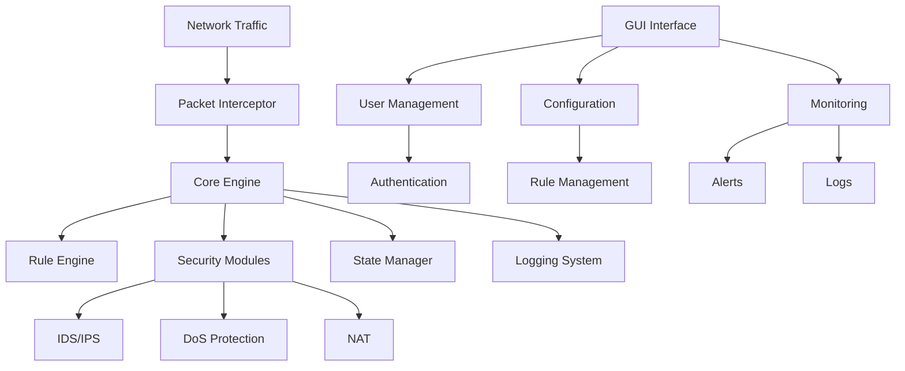
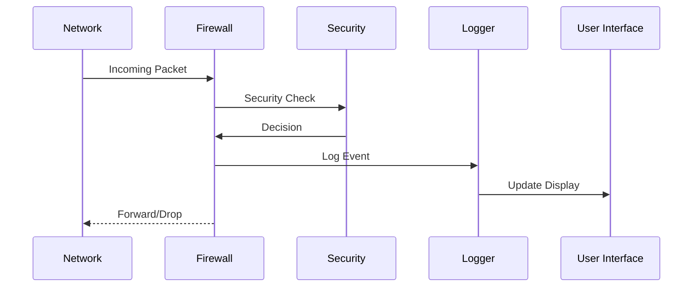
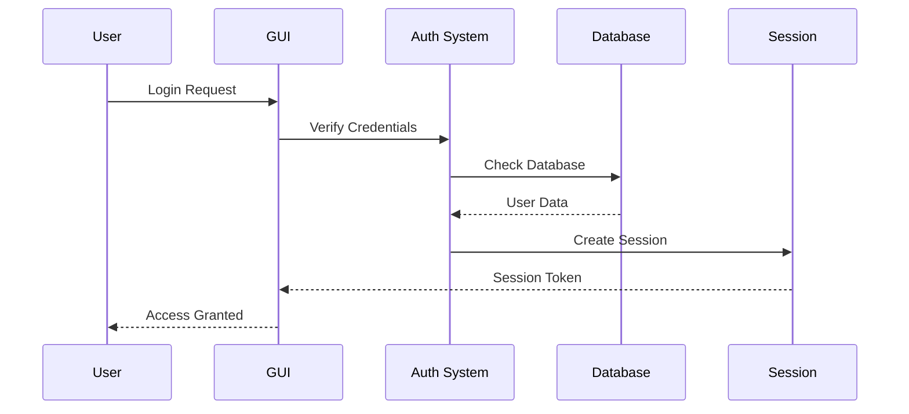
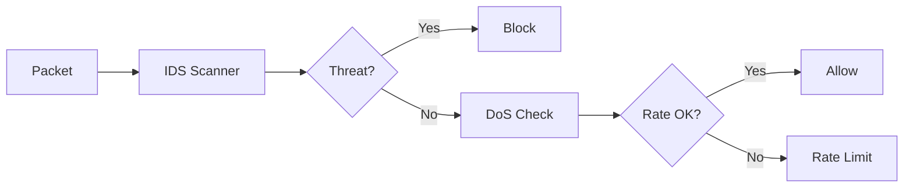
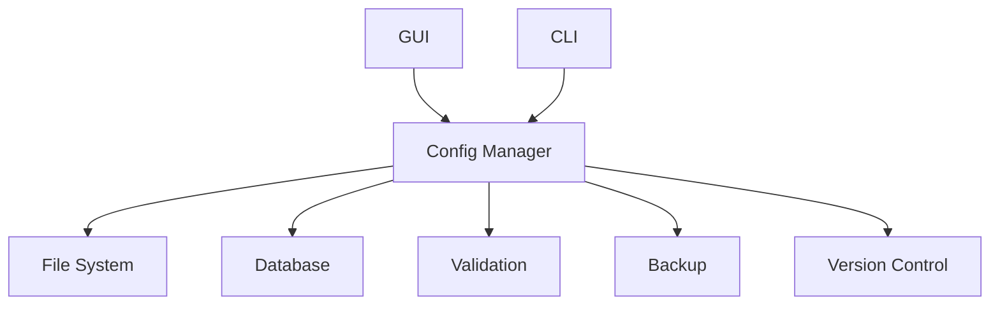
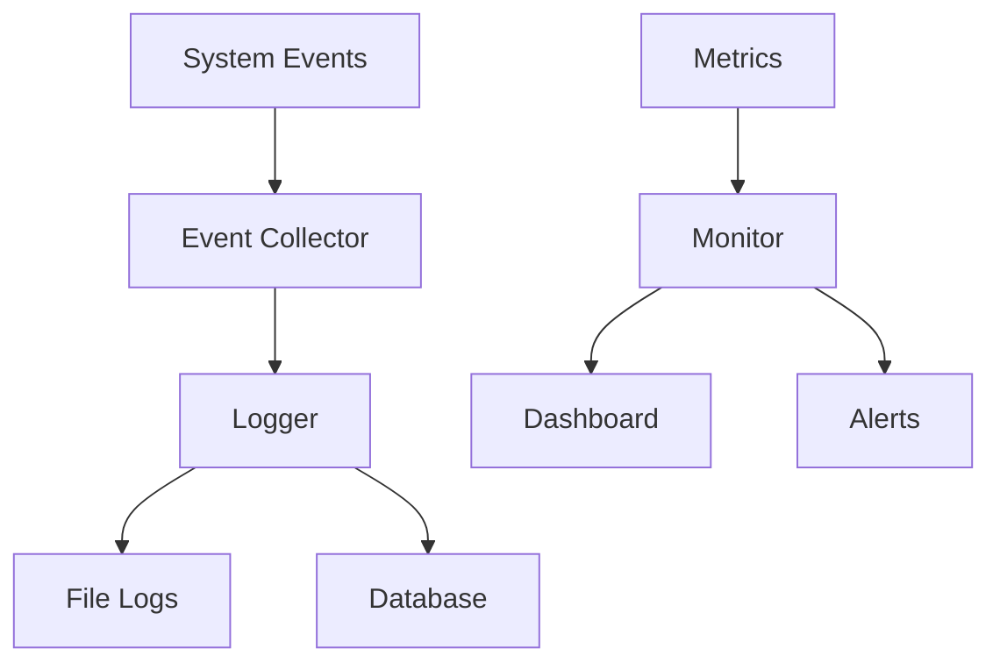
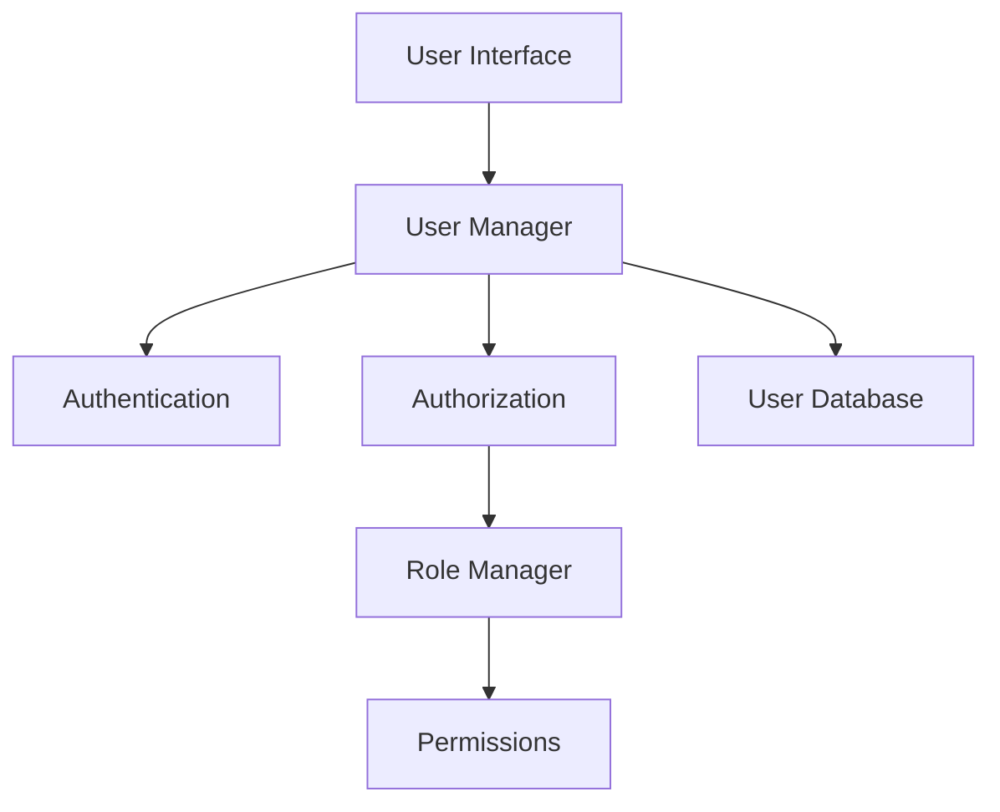
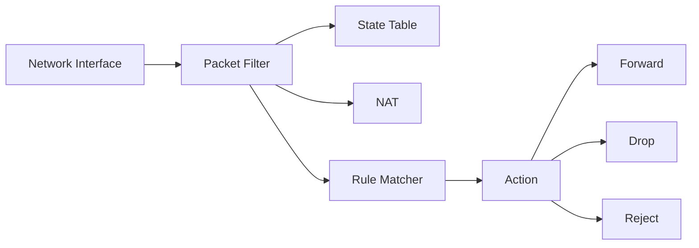
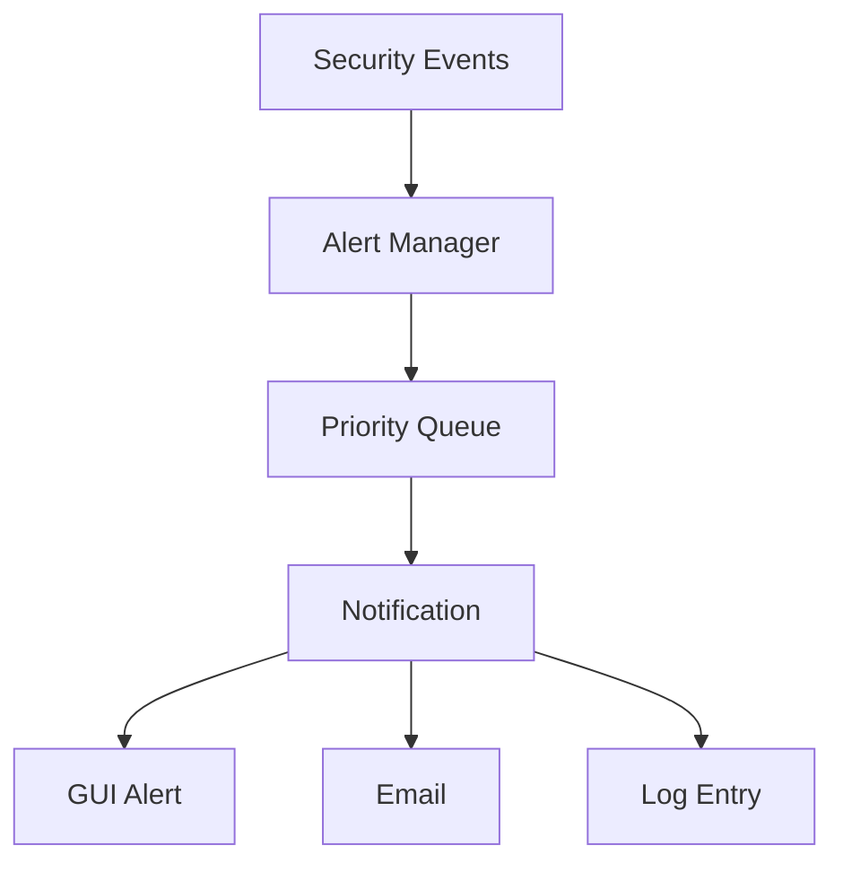
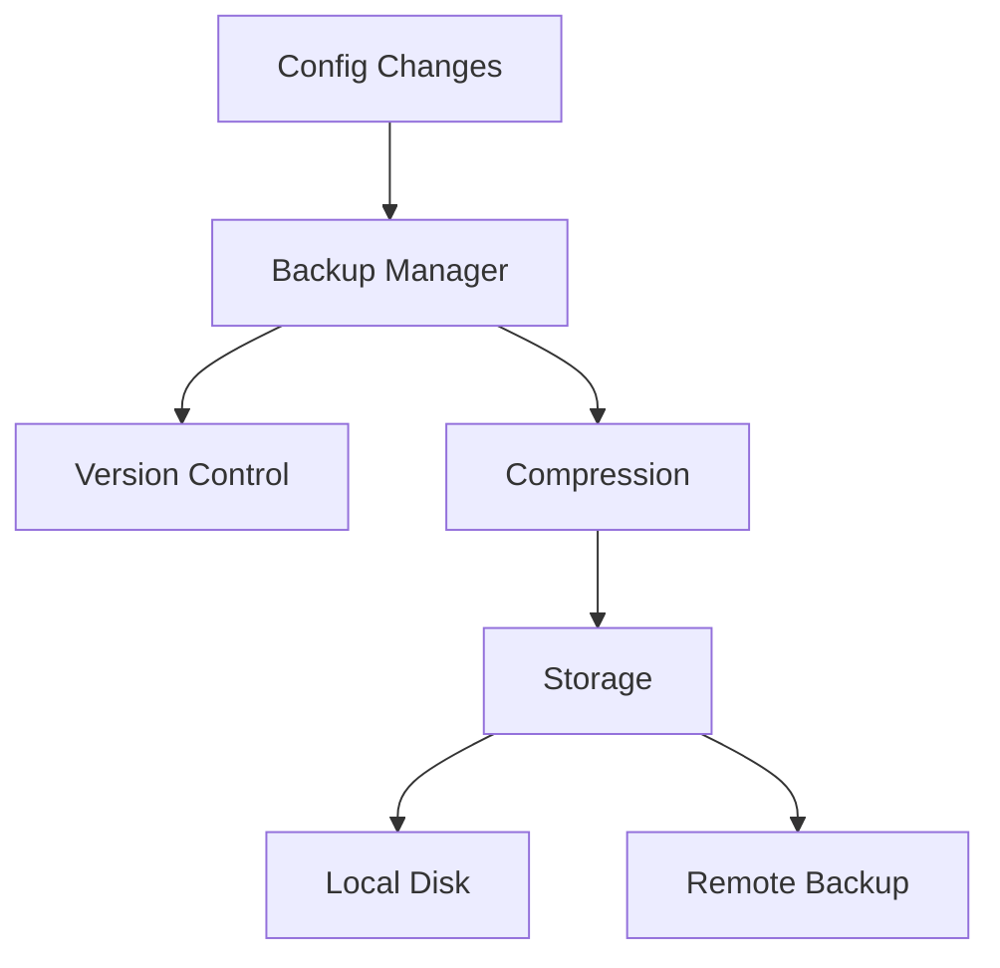

# BaselFirewall Architecture Diagrams

## System Architecture

## Data Flow

## User Authentication

## Security Module Interaction

## Configuration Management

## Monitoring System

## User Management

## Network Processing

## Alert System

## Backup System
