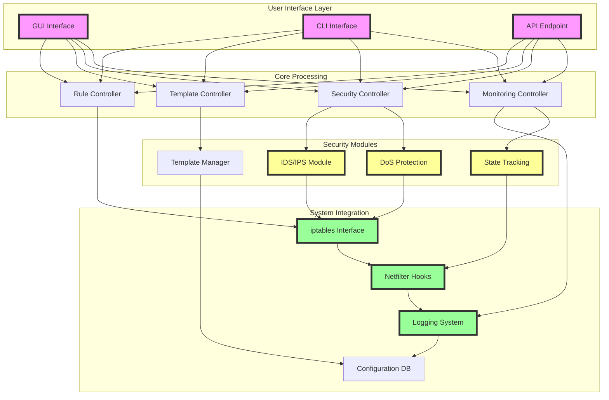
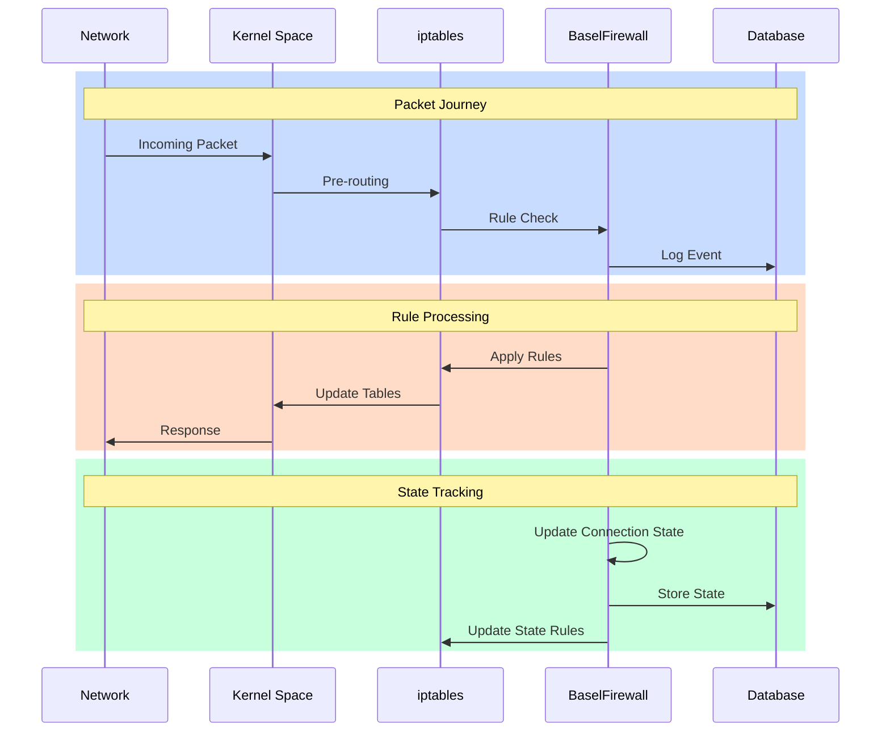
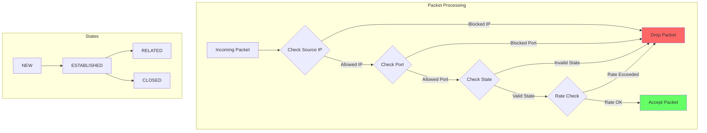
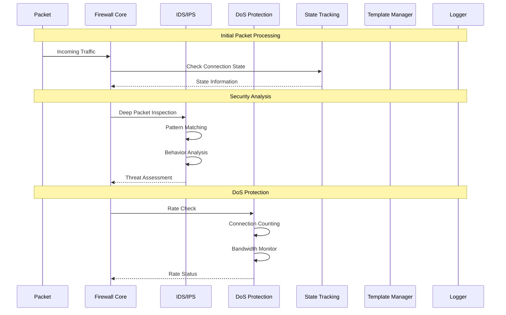
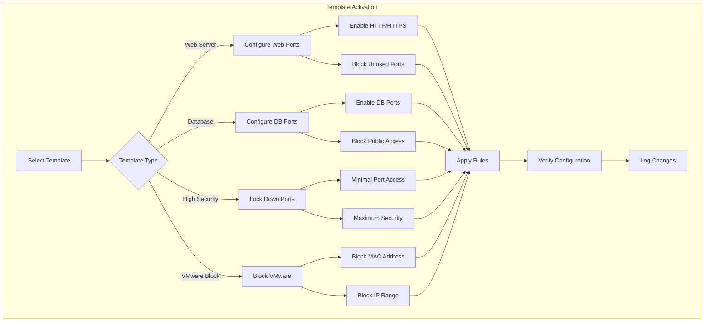

# BaselFirewall: Complete System Visualization

## 1. System Architecture Overview

### 1.1 Core Components Diagram


### 1.2 Network Stack Integration


## 2. Security Features

### 2.1 Packet Processing Flow


### 2.2 Security Response Sequence


## 3. Template System

### 3.1 Template Management Flow


## 4. Animation Sequences

### 4.1 System Initialization
1. Kernel Space Initialization
   - Load network drivers
   - Initialize iptables
   - Set up Netfilter hooks

2. BaselFirewall Startup
   - Load configuration
   - Initialize modules
   - Start monitoring

3. Service Integration
   - Connect to logging system
   - Initialize database
   - Start user interfaces

### 4.2 Attack Response Sequences

#### Port Scan Detection
1. Multiple Port Connection Attempts
   - Show connection patterns
   - Highlight suspicious ports
   - Display detection threshold

2. IDS Response
   - Pattern recognition
   - Alert generation
   - Rule updates

3. System Action
   - Block source IP
   - Log events
   - Admin notification

#### DoS Attack Response
1. Traffic Analysis
   - Show traffic spike
   - Connection counter
   - Bandwidth monitor

2. Protection Measures
   - Rate limiting
   - Connection dropping
   - IP blocking

3. System Recovery
   - Clear connection table
   - Update rules
   - Reset counters

#### VMware Attack Response
1. Detection Phase
   - MAC address identification
   - Traffic pattern analysis
   - Behavior monitoring

2. Response Phase
   - Apply VMware block template
   - Update firewall rules
   - Enable enhanced logging

3. Protection Phase
   - Block similar MAC ranges
   - Monitor virtualization signatures
   - Log all related activities

## 5. Technical Specifications

### 5.1 Network Integration
```
Kernel Level Integration:
- Netfilter hooks: PRE_ROUTING, POST_ROUTING
- iptables chains: INPUT, OUTPUT, FORWARD
- Connection tracking: nf_conntrack
- State management: conntrack_state
```

### 5.2 Security Modules
```
IDS/IPS Configuration:
- Pattern matching engine: regex, signature-based
- Behavior analysis: statistical anomaly detection
- Response mechanisms: block, alert, log

DoS Protection Settings:
- SYN flood protection: syn_rate_limit
- Connection limiting: conn_limit_per_ip
- Bandwidth monitoring: bw_monitor

State Tracking Parameters:
- Connection timeout: 3600s (default)
- UDP timeout: 30s
- ICMP timeout: 30s
- TCP established: 432000s
```

### 5.3 Template Configurations
```
Web Server Template:
- Allowed ports: 80, 443
- Blocked ports: 22, 23, 25
- Security features: all enabled

Database Template:
- Allowed ports: 3306, 5432
- Blocked ports: 80, 443, 22
- Security features: maximum

High Security Template:
- Allowed ports: 22 only
- Blocked ports: 1-1024 (except 22)
- Security features: maximum + logging

VMware Block Template:
- Block MAC pattern: 00:0c:29
- Block ports: all except essential
- Security features: maximum + monitoring
```

## 6. Implementation Notes

### 6.1 Performance Considerations
- Rule processing order optimization
- Connection state caching
- Template pre-compilation
- Log rotation and management

### 6.2 Security Best Practices
- Default deny policy
- Principle of least privilege
- Regular template updates
- Comprehensive logging
- Real-time monitoring

### 6.3 Maintenance Procedures
- Regular rule cleanup
- Log analysis
- Template verification
- Performance monitoring
- Security auditing 