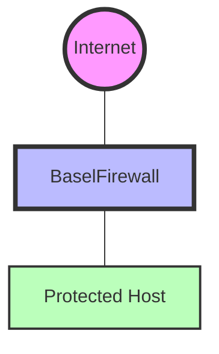
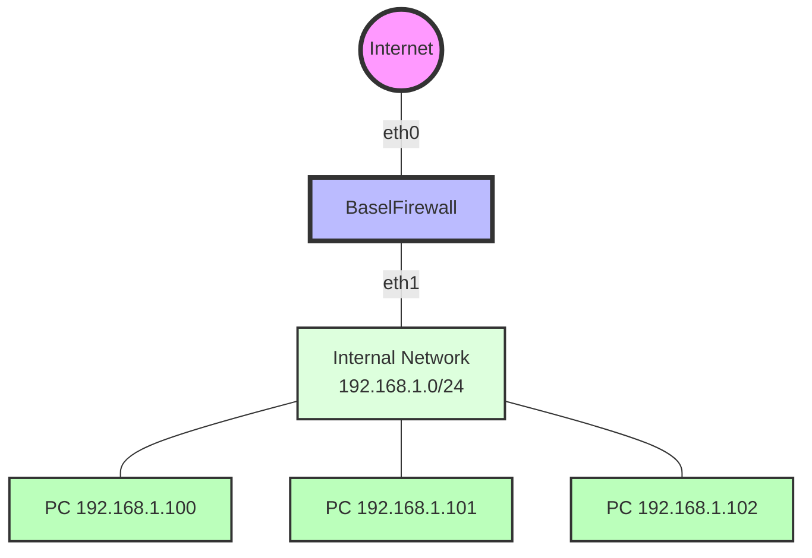
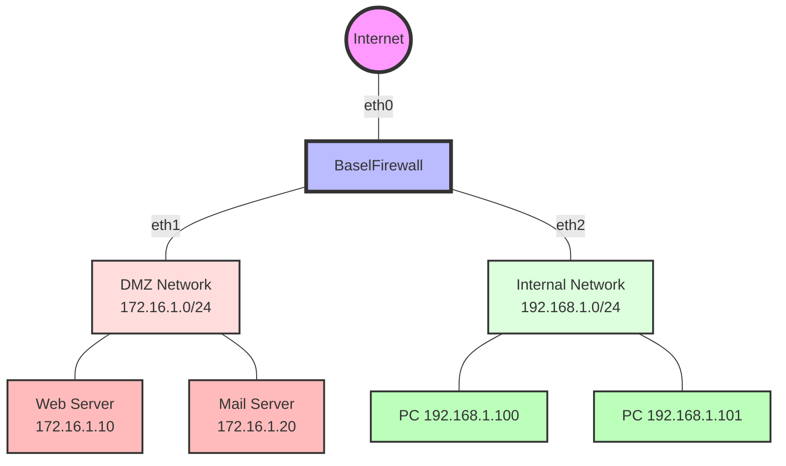
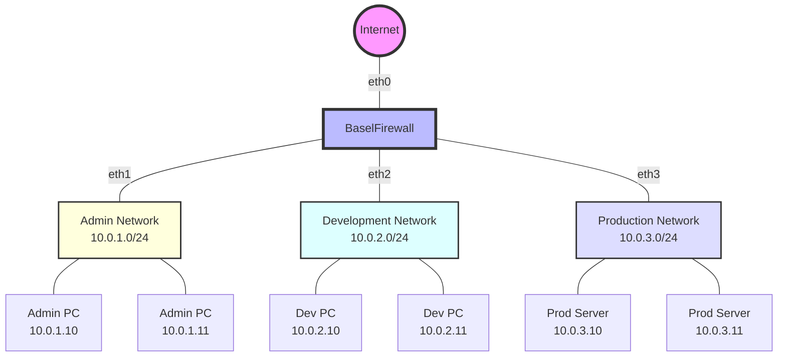

# BaselFirewall Network Topology

## Overview

BaselFirewall is designed to protect networks with various topologies. Below are the common deployment scenarios and their configurations.

## 1. Single Host Protection



### Configuration
```json
{
    "nat_enabled": false,
    "nat_config": {
        "external_interface": "eth0",
        "internal_interface": "",
        "internal_network": ""
    }
}
```

## 2. NAT Gateway Protection



### Configuration
```json
{
    "nat_enabled": true,
    "nat_config": {
        "external_interface": "eth0",
        "internal_interface": "eth1",
        "internal_network": "192.168.1.0/24"
    }
}
```

## 3. DMZ Configuration



### Configuration
```json
{
    "nat_enabled": true,
    "nat_config": {
        "external_interface": "eth0",
        "internal_interface": "eth2",
        "internal_network": "192.168.1.0/24"
    },
    "dmz_config": {
        "interface": "eth1",
        "network": "172.16.1.0/24",
        "allowed_services": {
            "172.16.1.10": [80, 443],
            "172.16.1.20": [25, 587, 993]
        }
    }
}
```

## 4. Multi-Network Segmentation



### Configuration
```json
{
    "nat_enabled": true,
    "nat_config": {
        "external_interface": "eth0",
        "internal_interfaces": ["eth1", "eth2", "eth3"],
        "network_segments": {
            "admin": {
                "interface": "eth1",
                "network": "10.0.1.0/24",
                "access_level": "high"
            },
            "development": {
                "interface": "eth2",
                "network": "10.0.2.0/24",
                "access_level": "medium"
            },
            "production": {
                "interface": "eth3",
                "network": "10.0.3.0/24",
                "access_level": "restricted"
            }
        }
    }
}
```

## Network Security Zones

### Internet Zone (Red)
- Untrusted external network
- All incoming traffic filtered
- Only allowed protocols and ports

### DMZ Zone (Yellow)
- Semi-trusted network
- Public-facing services
- Limited access to internal network

### Internal Zone (Green)
- Trusted internal network
- Strict access controls
- Protected resources

## Traffic Flow Rules

1. **Internet → DMZ**
   - Allowed: Specific ports (80, 443, 25)
   - Blocked: All other traffic

2. **DMZ → Internal**
   - Allowed: Specific services only
   - Blocked: Direct access

3. **Internal → DMZ**
   - Allowed: Required services
   - Logged: All connections

4. **Internal → Internet**
   - Allowed: Through NAT
   - Filtered: By content rules

## Implementation Notes

1. **Interface Configuration**
   - Use consistent naming
   - Document IP ranges
   - Set appropriate MTU

2. **VLAN Support**
   - Tag interfaces properly
   - Configure switch ports
   - Maintain VLAN database

3. **Routing**
   - Configure static routes
   - Enable IP forwarding
   - Set up NAT rules

4. **Monitoring**
   - Track interface status
   - Monitor bandwidth
   - Log zone transitions 